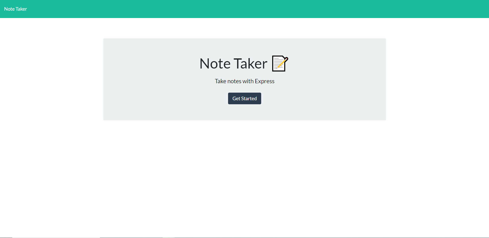
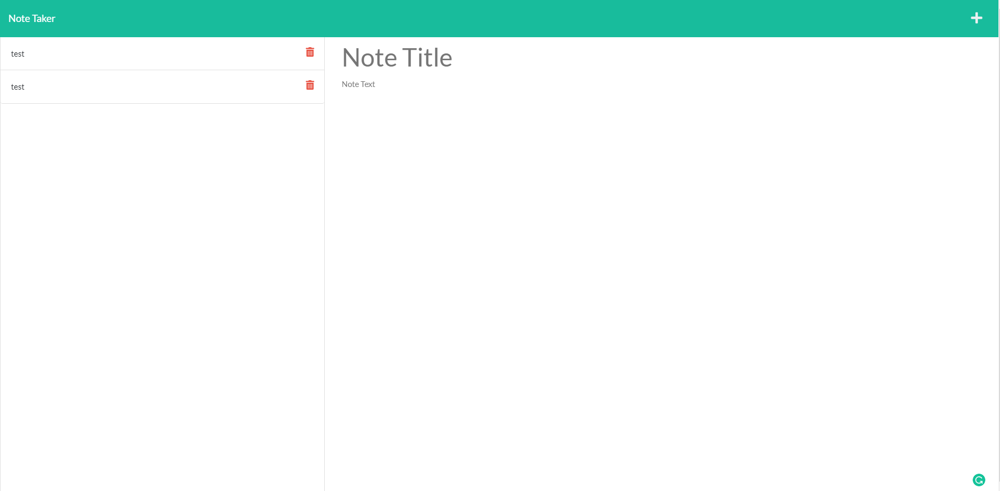

# Note-taker-app

## Table of Contents
- [Description](#description)
- [Authors](#authors)
- [Deployed Link](#deployed-link)
- [Functionality](#functionality)
- [How to Contribute](#contribute)
- [Resources](#resources)
### Description

This is a Note taking application which allows users to save, reference, and deleted notes. Once users have finished writing their note, a save button appears on the top right allowing users to save the note that they have created. The note will be saved on the left displaying the title the user provided. These notes can be referenced again by clicking the name but the content cannot be altered at the moment. The user also has an option to delete the note as well by pressing the red trash can icon. The note will be then deleted from the file source and cannot be referenced again. 

Building this note taking application allowed be to further build upon by node.js and express.js skills to create server requests. I especially learned to better understand how server request work and how to set up the basics if required in the future. Another thing I learned while building this project was on how to modularize my code to keep it dry and clean allowing my code to be more readable. An issue I encountered while building this project was the deleted request to remove a certain note. I fized this issue by removing a certain loop and reorganizing my file paths so that my delete request was referencing the correct file. Once I fixed this issue, the application was able to delete any note once deployed. 

In the future, I hope to add more functionality features such as being able to alter already existing notes. Currently the note cannot be altered once it has been created so I hope to implement that feature in the future. Another feature that would be nice would be to set the time or some way to reorder the notes. The notes are added to the bottom of the list at the moment. 

## Authors
- Takara Truong

## Deployed Link

https://rocky-brook-23536.herokuapp.com/

## Functionality: 

## Contribute

To contribute, contact me at https://github.com/truont2/

## Resources 

* https://www.youtube.com/watch?v=L72fhGm1tfE&amp;t=2s&amp;ab_channel=TraversyMedia
* http://expressjs.com/en/guide/routing.html
